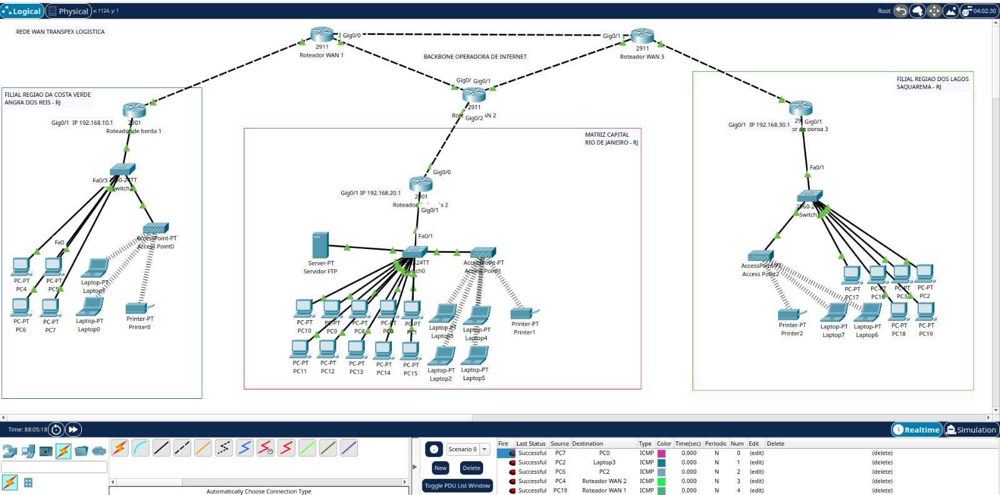
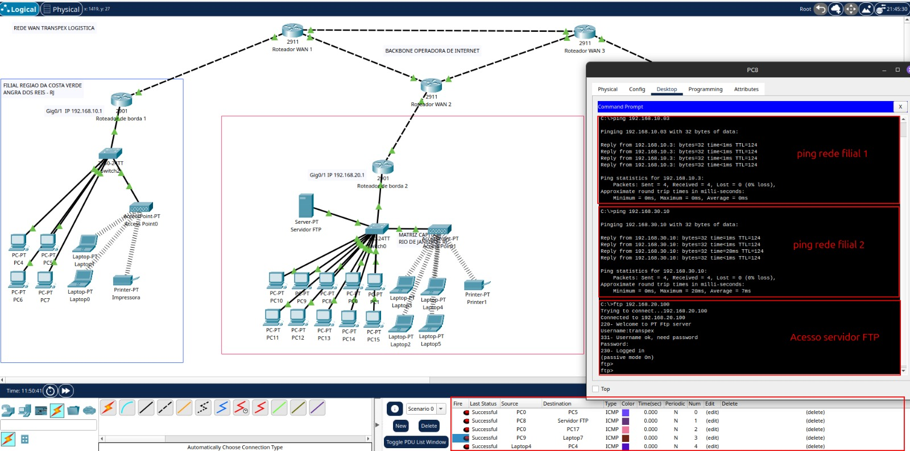
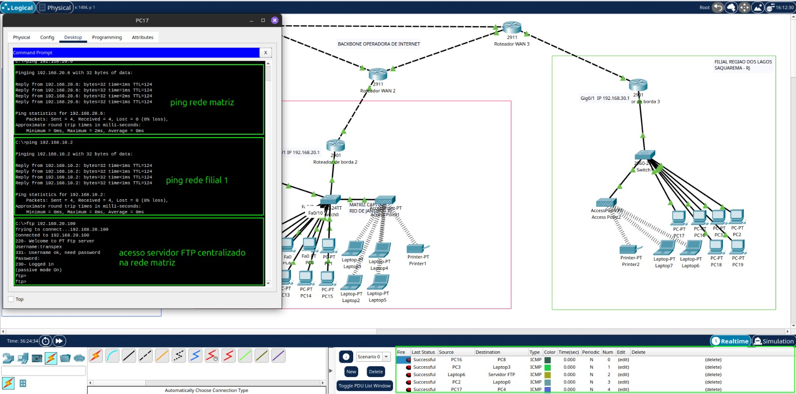

# 🚛 Transpex Logística - Projeto de Rede WAN

## 📌 Visão Geral

Este projeto representa a rede corporativa da **Transpex Logística**, que conecta a matriz localizada no **Rio de Janeiro (Capital)** com as filiais nas regiões **Costa Verde (Angra dos Reis - RJ)** e **Região dos Lagos (Saquarema - RJ)**.  
A rede foi implementada utilizando **roteadores Cisco**, **switches gerenciáveis**, **Access Points**, além de um **Servidor FTP centralizado na matriz**.

O objetivo principal é garantir **comunicação entre todas as LANs** via **WAN** e fornecer **serviços centralizados**, como o FTP para compartilhamento de arquivos entre matriz e filiais.

---

## 🖧 Topologia da Rede

A topologia da rede foi projetada no **Cisco Packet Tracer** conforme o diagrama abaixo:


### 🌐 Backbone

- **Operadora de Internet** responsável por interligar os roteadores WAN das filiais e da matriz.
- Comunicação estabelecida entre os roteadores através de interfaces **GigabitEthernet**.

### 🟥 Matriz (Capital - Rio de Janeiro)

- **Faixa de rede**: `192.168.20.0/24`
- **Gateway**: `192.168.20.1`
- **Dispositivos**:
  - Vários PCs e Laptops conectados ao Switch central
  - 1 Impressoras
  - Access Point para dispositivos móveis
  - **Servidor FTP** para acesso de todas as filiais e matriz
- **Função principal**: núcleo da rede, hospedagem de serviços e gerenciamento.

### 🟦 Filial 1 - Região Costa Verde (Angra dos Reis - RJ)

- **Faixa de rede**: `192.168.10.0/24`
- **Gateway**: `192.168.10.1`
- **Dispositivos**:
  - Vários PCs e Laptops conectados ao Switch central
  - 1 Impressoras
  - Access Point para conexões sem fio
- **Função principal**: escritório regional com acesso total aos recursos da matriz.

### 🟩 Filial 2 - Região dos Lagos (Saquarema - RJ)

- **Faixa de rede**: `192.168.30.0/24`
- **Gateway**: `192.168.30.1`
- **Dispositivos**:
  - Vários PCs e Laptops conectados ao Switch central
  - 1 Impressoras
  - Access Point para conexões sem fio
- **Função principal**: escritório regional com acesso total aos recursos da matriz.

---

## ⚙️ Serviços Implementados

### 🔹 DHCP

- Cada roteador local atua como servidor DHCP para sua respectiva LAN.
- Isso elimina a necessidade de configuração manual de IPs nos dispositivos.

### 🔹 FTP

- Servidor FTP centralizado na **Matriz (192.168.20.0/24)**.
- Todas as filiais têm acesso ao servidor via **WAN**.
- Configurado para permitir upload/download de arquivos corporativos, acesso(login: transpex / Senha: 1234).

### 🔹 Roteamento

- Configuração de rotas estáticas entre os roteadores para garantir comunicação entre todas as redes locais.
- Exemplo: LAN da Costa Verde (`192.168.10.0/24`) consegue acessar o FTP na Matriz (`192.168.20.0/24`).

---

📂 Estrutura do Repositório

- `transpex-logistica-WAN.pkt` → Arquivo do Cisco Packet Tracer com a topologia pronta.
- `README.md` → Documentação do projeto.
- `imagens/` → Pasta com capturas de tela dos testes e diagramas.
  - `topologia-de-rede.jpeg` → Imagem ilustrativa da rede.
  - `teste-filial1-matriz-filial2.jpeg` → Teste de conectividade entre Filial 1, Matriz e Filial 2.
  - `teste-filial2-matriz-filial1.jpeg` → Teste de conectividade entre Filial 2, Matriz e Filial 1.
  - `teste-matriz-filial1-filial2.jpeg` → Teste de conectividade entre Matriz, Filial 1 e Filial 2.

---

🚀 Como abrir o projeto para testar a conectividade da Rede

1. Instale o [Cisco Packet Tracer](https://www.netacad.com/courses/packet-tracer) (versão **8.2 ou superior**).
2. Clone este repositório:
   ```bash
   git clone https://github.com/michellsadalla/transpex-logistica-WAN.git
   cd transpex-logistica-WAN
   ```
3. Abra o arquivo 'transpex-logistica-WAN.pkt' com o packet tracer para verificar configurações e testes de conectividade em tempo real.

---

## 📡 Testes de Conectividade e Acesso

Para validar a configuração da rede e garantir a comunicação entre os dispositivos e o servidor, foram realizados testes de conectividade e autenticação via FTP entre as Redes.

---

# Testes de Rede 🟥 Matriz --> 🟦 Filial 1 / 🟥 Matriz --> 🟩 Filial 2

✅ Ping endpoints Matriz para Filial 1 e 2
✅ Acesso servidor FTP centralizado



---

# Testes de Rede 🟦 Filial 1 --> 🟥 Matriz / 🟦 Filial 1 --> 🟩 Filial 2

✅ Ping endpoints Filial 1 para Matriz e Filial 2
✅ Acesso servidor FTP centralizado


---

# Testes de Rede 🟩 Filial 2 --> 🟥 Matriz / 🟩 Filial 2 --> 🟦 Filial 1

✅ Ping endpoints Filial 2 para Matriz e Filial 1
✅ Acesso servidor FTP centralizado



---

## ✅ Conclusão

A rede projetada garante:

- **Integração total** entre matriz e filiais.
- **Gerenciamento simplificado** com DHCP.
- **Centralização de serviços** com servidor FTP.
- **Escalabilidade** para inclusão de novas filiais e serviços.
